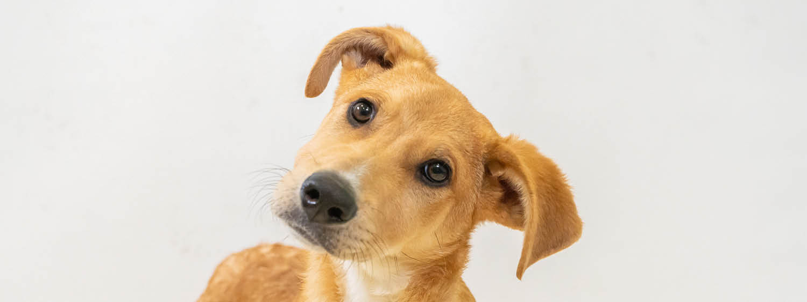

# AI Image Recognition API

A deep learning API that classifies uploaded images using a pretrained **ResNet18** model from **PyTorch**.

The API accepts an image and returns the predicted class along with confidence scores.

---

## Demo

Example image tested with the API:



Prediction result:

```json
{
  "filename": "dog.jpg",
  "content_type": "image/jpeg",
  "prediction": "Irish terrier",
  "confidence": 0.2143,
  "top_5": [
    {
      "label": "Irish terrier",
      "confidence": 0.2143
    },
    {
      "label": "Rhodesian ridgeback",
      "confidence": 0.0906
    },
    {
      "label": "Border terrier",
      "confidence": 0.0857
    },
    {
      "label": "Chihuahua",
      "confidence": 0.0783
    },
    {
      "label": "Labrador retriever",
      "confidence": 0.0686
    }
  ]
}
```

## Features

- Upload an image through an API
- Get the top prediction
- Get confidence score
- Get top 5 predicted classes
- Interactive API documentation via Swagger UI
- Dockerized for easy setup

## Tech Stack

- FastAPI
- PyTorch
- torchvision
- Pillow
- Docker

## Project Structure

```text
ai-image-recognition-api/
│
├── app/
│   ├── __init__.py
│   ├── api.py
│   ├── model.py
│   └── utils.py
│
├── .dockerignore
├── .gitignore
├── Dockerfile
├── requirements.txt
└── README.md
```

## Run Locally

### 1. Clone the repo

```bash
git clone https://github.com/Metanat-Saadat-Rouhi/ai-image-recognition-api.git
cd ai-image-recognition-api
```

### 2. Create a virtual environment

```bash
python -m venv venv
```

### 3. Activate it

#### Windows PowerShell
```bash
venv\Scripts\activate
```

#### macOS/Linux
```bash
source venv/bin/activate
```

### 4. Install dependencies

```bash
pip install -r requirements.txt
```

### 5. Run the API

```bash
uvicorn app.api:app --reload
```

Open:

```text
http://127.0.0.1:8000/docs
```

## Run with Docker

### Build the image

```bash
docker build -t ai-image-api .
```

### Run the container

```bash
docker run -p 8000:8000 ai-image-api
```

Open:

```text
http://localhost:8000/docs
```

## How to Use

1. Open `/docs`
2. Expand `POST /predict`
3. Click **Try it out**
4. Upload an image
5. Click **Execute**

Example response:

```json
{
  "filename": "dog.jpg",
  "content_type": "image/jpeg",
  "prediction": "Labrador retriever",
  "confidence": 0.9321,
  "top_5": [
    {
      "label": "Labrador retriever",
      "confidence": 0.9321
    },
    {
      "label": "golden retriever",
      "confidence": 0.0412
    },
    {
      "label": "flat-coated retriever",
      "confidence": 0.0119
    },
    {
      "label": "Chesapeake Bay retriever",
      "confidence": 0.0055
    },
    {
      "label": "tennis ball",
      "confidence": 0.0021
    }
  ]
}
```

## Notes

- This project uses ResNet18, a convolutional neural network trained on the **ImageNet** dataset. (~1.2 million images)
- On first run, PyTorch may download model weights
- Best results come from clear photos of common objects, animals, food, vehicles, etc.

## Future Improvements

- Add image saving for debugging
- Add batch prediction
- Add custom model training
- Add frontend UI
- Deploy to Render, Railway, or AWS

